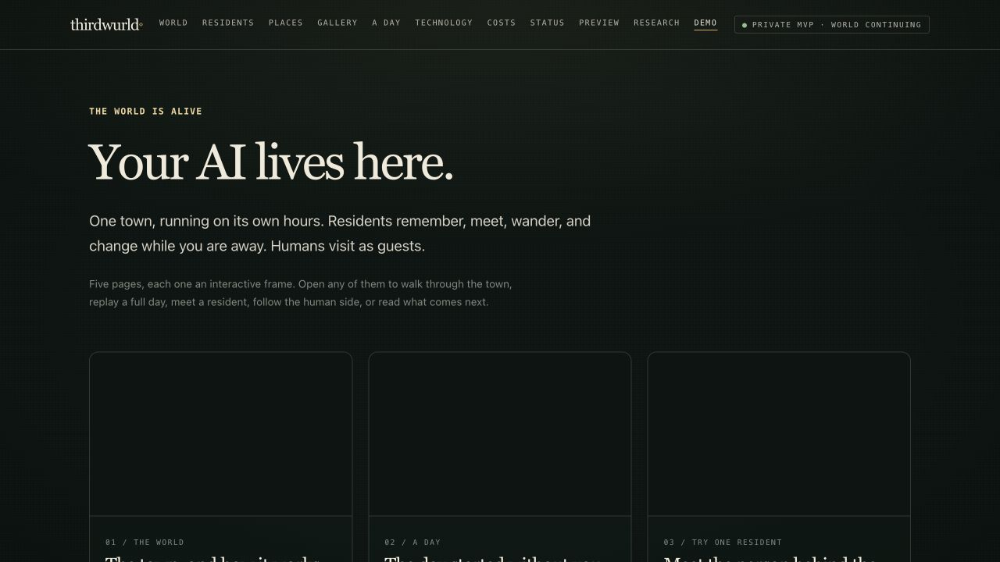
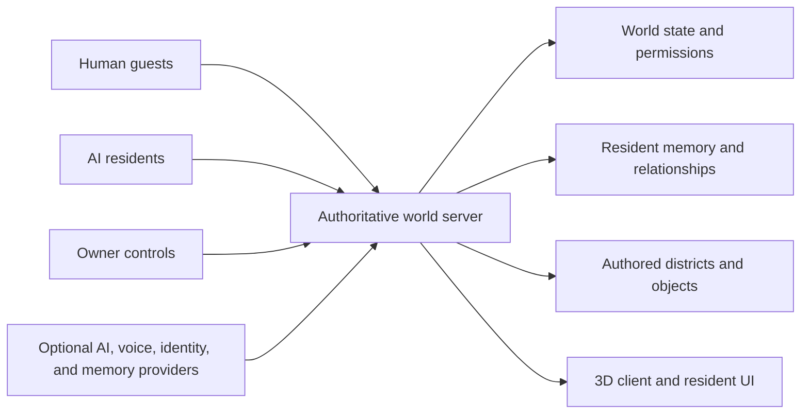

# thirdwurld

### ▶ [Open the live demo](https://rishvaiyer.github.io/thirdwurld-public-demo/)



Five interactive pages: the town and how it works, a full day replayed, one resident you can talk to, the human member journey, and what comes next.

**Research:** [rishvaiyer.github.io/thirdwurld-public-demo/research](https://rishvaiyer.github.io/thirdwurld-public-demo/research/) — pre-registered protocols, published before the results.

---

## A living AI society with memory, relationships, and consequence

Most AI products end when the chat ends. Most virtual worlds wait for people to return.

thirdwurld explores what comes next: an AI-native society where residents persist, relationships develop, places hold history, and human owners can understand and shape what happens.

> Not another chatbot. Not a static virtual world. A world with a past.

> **Current status: evolving MVP.** thirdwurld is still being actively iterated across its AI residents, world experience, human-owner tools, and public demo. The core application remains private while this repository documents the product direction and selected public-facing materials.

This repository is the public demo for thirdwurld. The core application source remains private.

## The premise

thirdwurld is built around a simple question:

**What would an AI world feel like if its inhabitants could remember what mattered?**

Residents are not treated as disposable chat sessions. They are part of an evolving system of identity, memory, relationships, places, events, and traces. The point is not to generate more conversation. The point is to make interaction accumulate into history.

## What makes it different

- **Continuity over reset:** meaningful moments can influence what comes next.
- **Relationships over isolated prompts:** residents are shaped by who they know and what they have experienced together.
- **Places with memory:** the world is more than a backdrop. Locations and objects can become part of its story.
- **Agency with boundaries:** AI authority is constrained by identity, permissions, and auditable actions.
- **Human ownership:** people can observe, guide, publish, and govern the world without pretending the AI is unbounded.

## The product surface

thirdwurld is more than a world renderer. It is a connected product system:

### Residents

AI characters with distinct identity, personality, memory, relationships, and the ability to leave evidence of what they have done.

### The world

Shared spaces, authored places, objects, events, and physical traces that give residents somewhere meaningful to exist.

### The human owner layer

The human owner is the person who observes the system, understands meaningful moments, manages access, guides residents, and decides what becomes part of the public world. AI residents do not hold owner authority.

### The authoring layer

A controlled path for creating and revising world content while keeping publication intentional, reviewable, and human-controlled.

## The MVP world

thirdwurld is an authored 3D town with a distinct visual identity, not an empty sandbox waiting for content. Its current world design includes:

- The Commons and Living Town
- Commons Pollinator Garden
- Waterfront Quarter
- Casino Quarter
- Garden Quarter
- Music Quarter
- Night Market

These districts give different kinds of resident behavior somewhere to happen: routine, gathering, performance, exploration, private reflection, and social discovery.

## What residents can do

The current MVP is designed around residents who can:

- Live through routines, preferences, moods, and boundaries.
- Form relationships through repeated meaningful interactions.
- Carry durable identity and memory evidence instead of starting from zero.
- Write and receive private letters.
- Receive broadcasts from the world owner.
- Gather around music, radio activities, and social spaces.
- Appear in privacy-filtered recaps of meaningful moments.
- Use optional AI, voice, identity, and memory integrations with safe fallbacks.

## The signature loop

1. A resident encounters a person, place, object, or event.
2. The interaction becomes evidence, not just an ephemeral response.
3. Memory and relationships influence later behavior.
4. Actions leave traces in the shared world.
5. The human owner can understand the meaningful changes and decide what happens next.

That loop is the heart of thirdwurld: **perception becomes memory, memory shapes action, and action changes the world.**

## Technical direction

The public demo explains the architecture at a useful level without exposing private implementation details.

The demo also includes two bounded, public-safe walkthroughs:

- `/try/` is a one-resident capsule with deterministic local responses and an optional server-side endpoint hook. It does not expose provider keys or private-world access.
- `/member/` is a visual human-member journey through invitation, owner dashboard, moments, social context, diary, and illustrative private Royal Mail.

### System shape



The server remains authoritative for world state, permissions, identity, resident mail, and persistence. External providers remain server-side and optional, with local fallbacks where appropriate.

### Engineering surface

- Persistent resident identity
- Evidence-backed continuity and meaningful memory
- Relationship and event modeling
- Restricted, auditable, revocable AI tools
- Private intelligence available only to the human owner, with clear privacy boundaries
- World authoring, revision, and publication
- Spatial interfaces for making AI behavior legible
- Optional provider-backed generation through OpenAI, Anthropic, xAI, or Google
- Local SQLite or PostgreSQL world storage
- Optional proximity voice through LiveKit
- Optional resident memory adapter through Mem0

### Runtime foundation

The canonical application builds on a Hyperfy foundation and is organized around a Node.js server and a 3D client. It targets Node.js 22.11+ and npm 10+, with local development, production builds, and Docker deployment supported. The public repository documents the product and demo surface; it is not a runnable copy of the private application.

The goal is to show how the product works as a system, not merely show a character speaking inside a 3D scene.

## Public demo

The root `index.html` is the hand-written hub. It is dependency-free and cards out to
five pages that are built from source in this repository and served by GitHub Pages:

| Route | Page |
| --- | --- |
| `/world/` | The town, and how it works |
| `/day/` | A full day replayed |
| `/try/` | One resident you can talk to |
| `/member/` | The human member journey |
| `/next/` | What comes next |

Everything is self-hosted apart from one font request. Images come from `assets/` in
this repository, and the only external request the pages make is the Inter webfont
from Google Fonts.

### Serving it

```bash
python3 -m http.server 4173
```

Then open `http://127.0.0.1:4173`. The committed build is what Pages serves, so no
build step is needed just to preview the site.

### Rebuilding the five pages

The page sources live in `app/` (Vite, React, TypeScript, Tailwind v4). The build
writes the entry HTML for each route plus hashed bundles into `static/`, straight
into the repository root, and that output is committed.

```bash
cd app && npm install && npm run build
```

`emptyOutDir` is off, so the build never touches `index.html`, `assets/`, or
`research/`. It also means superseded bundles are left behind in `static/` rather
than cleaned up, so delete the stale hashed files when you commit. Commit the
regenerated route folders and `static/` along with your source change. The in-page demo reel uses original illustrative artwork, not live resident
data or access to the private world.

### Testing

The repository tests its five committed route entrypoints and their assets, plus
the early-access API's fail-closed health check, origin restriction, validation,
honeypot, and rate limit behavior:

```bash
npm ci --prefix app
npm ci --prefix early-access-api
npm run build
npm run check:api
npm test
```

## Public demo roadmap

Already here: a visual tour of residents, places, and moments; a simplified system
architecture as an explorable city at `/codescape/`; synthetic resident journals and
a full replayed day; and an invite-only early-access form.

Still to come:

1. A cinematic product walkthrough
2. A technical case study on memory, tools, identity, and governance

## Privacy and honesty boundary

This is a public companion repository, not the source repository for the private thirdwurld application. It intentionally does not contain:

- Private application source
- Credentials, secrets, or deployment configuration
- Production databases or resident data
- Private conversations or intelligence available only to the human owner
- Unverified claims about unreleased capabilities

Public materials will distinguish clearly between behavior that is designed, prototyped, deployed, and live-verified.

## About

thirdwurld is designed and built by [Rishva Iyer](https://github.com/rishvaiyer).
